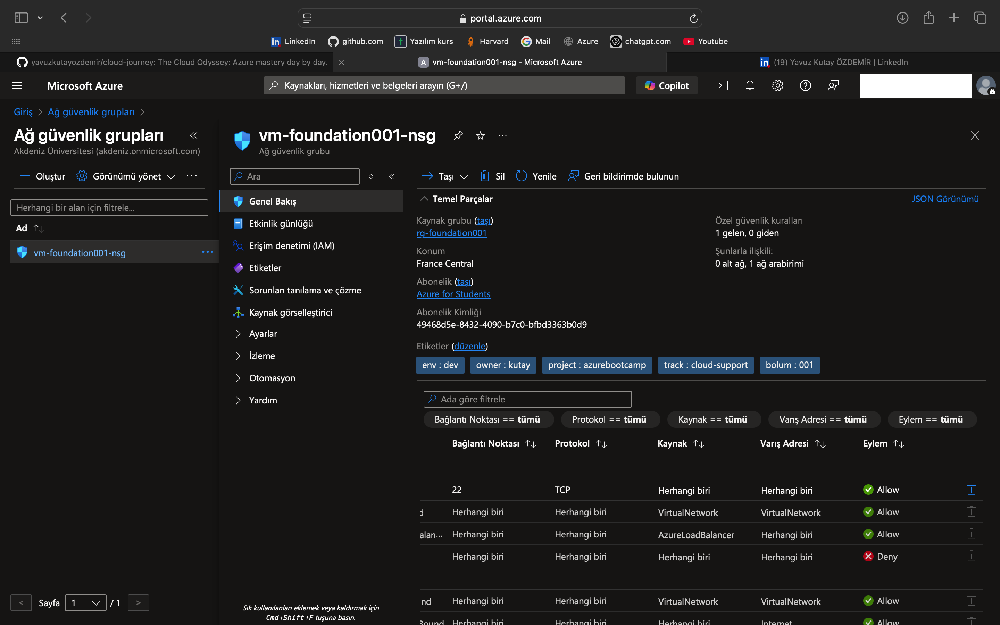

## Part 003 – Ekran Resmi 2025 04 20 23.03.05 (Day 4)

### Goal
<!-- Write what you aimed to achieve in this part -->

---

### Technical Steps
<!-- List the steps you followed, commands you used, and how you implemented the task -->

---

### Outcome
<!-- Summarize the result, what worked, and what challenges you faced -->

 

